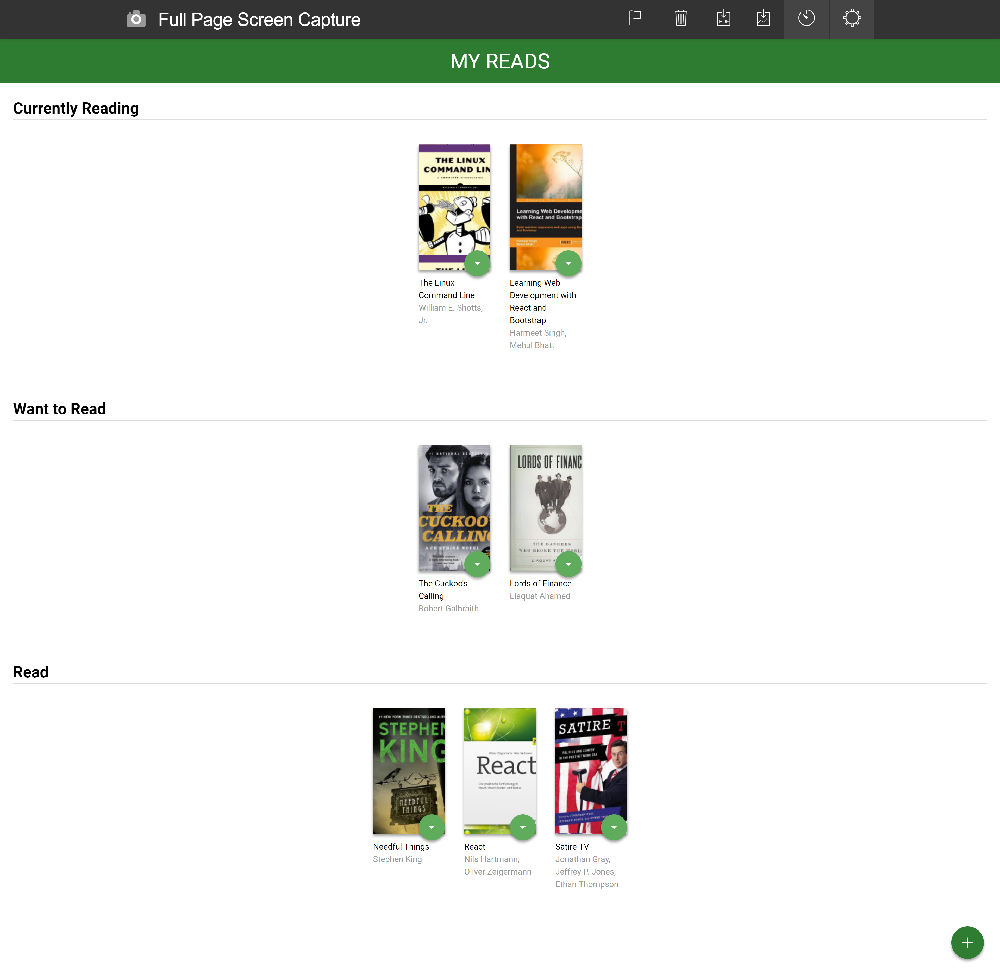
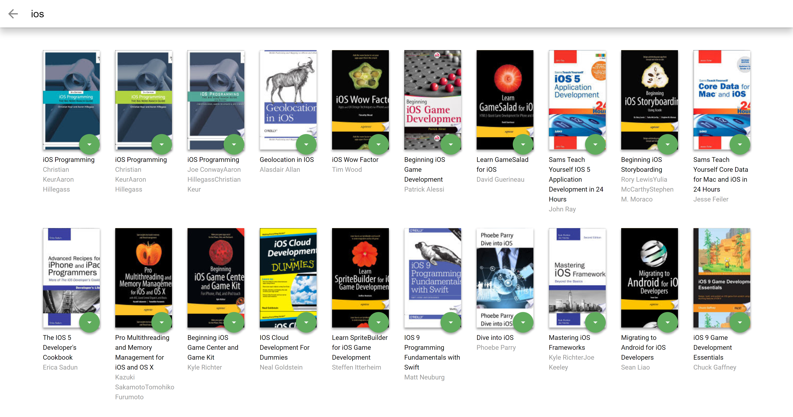

# MyReads Project
## A Book Tracking App

This is the final assessment project for Udacity's React Fundamentals course.

## Installantion

To install MyReads project:

* Clone repository
* Change directory to this app in terminal using cd /reactnd-project-myreads-starter
* install all project dependencies with `npm install`
* To start enter `npm start`

Project contains three bookshelf categories: Read, Want to Read, Currently Reading. This application allows you to select and categorize books. You can use search function to find the desired books. 

## Technology used
* React
* React Router
* ES6

## 

